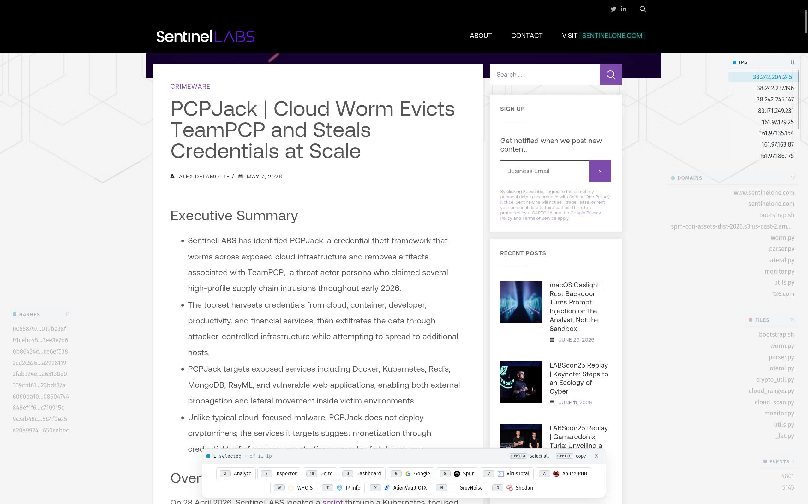
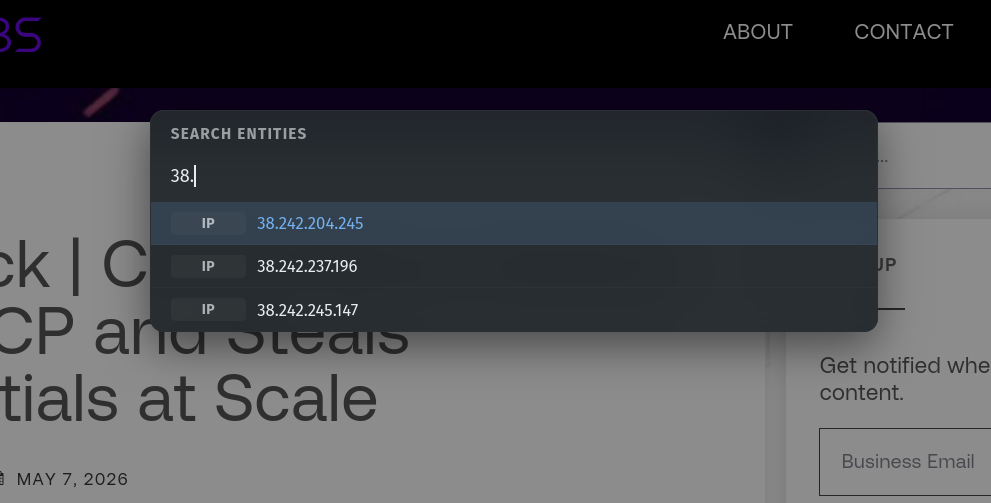
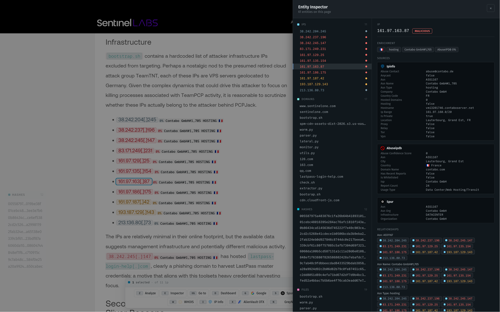
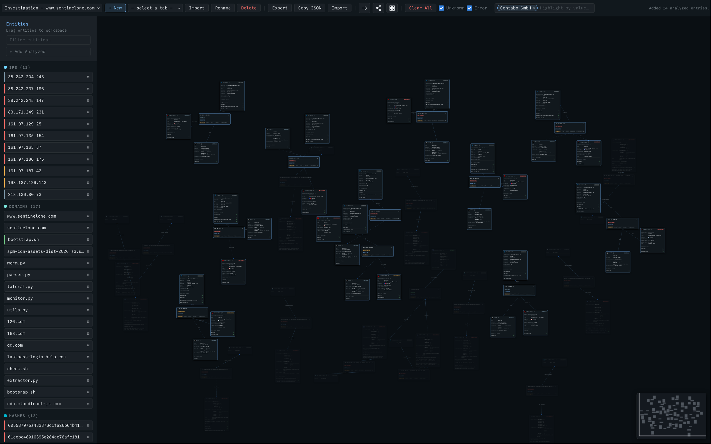

# Fishbowl

[](https://github.com/ma111e/fishbowl/actions/workflows/ci.yml)
[](https://github.com/ma111e/fishbowl/releases/latest)
[](LICENSE)
[](https://goreportcard.com/report/github.com/ma111e/fishbowl)

Fishbowl is a browser-based threat-investigation toolkit. It flags security
indicators on the pages you read and enriches them with threat intelligence.
Drag those entities onto a graph to map how they connect.

Fishbowl supports Chrome, Chromium-based browsers such as Edge, Brave, and
Opera, and Firefox.

## Install

Download the latest prebuilt binary for your platform from the
[releases page](https://github.com/ma111e/fishbowl/releases/latest), extract it,
and put `fishbowl` on your `PATH`. Confirm the install with `fishbowl version`.

## Quick start

```bash
fishbowl setup
```

This opens a local installation page. After the extension is installed,
`fishbowl setup` starts the backend on `localhost:7158` and prints a 6-digit
pairing code. Enter the code in the extension to enrol it, then keep the setup
process running while you use Fishbowl.

For later sessions, or to start the backend manually, run:

```bash
fishbowl server
```

Fishbowl scans supported web pages automatically. Browser-internal and other
restricted pages cannot be scanned by extensions.

API keys are optional. Register them interactively with:

```bash
fishbowl api register
```

## What it does

- **Inline detection.** IPs, domains, hashes (SHA-1 and SHA-256), file paths,
  Windows Event IDs, SIDs, and ASNs, including defanged input.
- **Threat-intelligence enrichment.** Query VirusTotal, AbuseIPDB, MalwareBazaar,
  Shodan, IPinfo, and Spur.
- **Investigation sandbox.** Drag entities onto a graph, map relationships
  across pages, and import or export investigations as JSON.
- **Local and authenticated.** Page content is processed on your machine, API
  keys live in an encrypted local vault, and extension-backend traffic is signed
  on both ends.

## Screenshots

<p align="center">
  
</p>
<p align="center"><em>Analyze an entity and pivot using multiple services</em></p>

<p align="center">
  
</p>
<p align="center"><em>Search any indicator detected on the current page</em></p>

<p align="center">
  
</p>
<p align="center"><em>Use the entity inspector to view enrichments and related indicators</em></p>

<p align="center">
  
</p>
<p align="center"><em>Build and explore a graph of entities collected across one or more pages. Here all entities matching a specific value are highlighted</em></p>

## Documentation

Full documentation is available in the [documentation index](docs/README.md):

- [Quick Start](docs/quick-start.md) | [Installation](docs/installation.md) |
  [API Keys](docs/api-keys.md)
- [Detecting Entities](docs/detecting-entities.md) |
  [Threat Intelligence](docs/threat-intelligence.md) |
  [Investigation Sandbox](docs/investigation-sandbox.md)
- [Interface](docs/interface.md) |
  [Keyboard Shortcuts](docs/keyboard-shortcuts.md)
- [CLI Reference](docs/cli-reference.md) |
  [Vault Cryptography](docs/vault-cryptography.md) |
  [Troubleshooting](docs/troubleshooting.md) | [FAQ](docs/faq.md)

## Build from source

Prerequisites: **Go** 1.25+, **python3** and **zip** (web build), and **Node** 18+
(`oxlint`).

```bash
make assets    # build the browser extensions and stage embedded assets
go build .     # build the fishbowl binary

make release   # full build: extensions + Linux and Windows binaries
```

## License

Fishbowl is released under the [MIT License](LICENSE).
